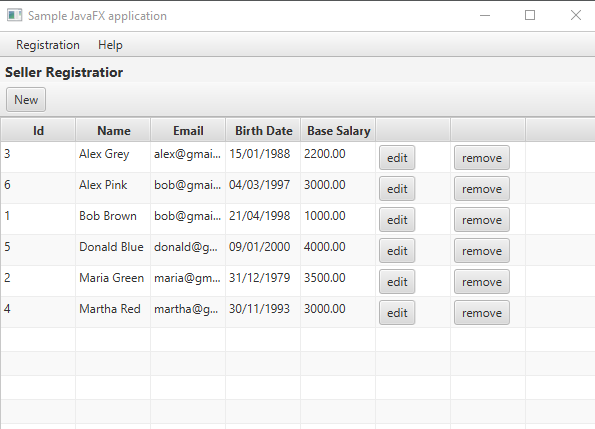

# Workshop-JavaFX-JDBC

This Java application implements a CRUD (Create, Read, Update, Delete) system for managing sellers and departments. It utilizes the JDBC framework for database connectivity with MySQL and JavaFX for the graphical user interface.

## Features

- **Create:** Add new sellers and departments to the database.
- **Read:** Retrieve information about sellers and departments from the database.
- **Update:** Modify existing seller and department details.
- **Delete:** Remove sellers and departments from the database.

## Getting Started

### Prerequisites

- Java Development Kit (JDK)
- MySQL Database Server
- MySQL Connector (JDBC Driver)
- JavaFX SDK (if not included in your JDK distribution)

### Installation

1. Clone the repository to your local machine:

2. Import the project into your preferred Java IDE (e.g., IntelliJ IDEA, Eclipse).

3. Configure the database connection settings in the source code to match your MySQL database credentials.

4. Build the project and run the main application class to launch the CRUD system.

## Screenshots

### Seller List Screen

### Seller Form Screen

### Department List Screen

## Technologies Used

- Java
- JavaFX
- JDBC (Java Database Connectivity)
- MySQL

## Contributors

- [CauZy-Dev](https://github.com/cauzy-dev)

## License

This project is licensed under the [Licença MIT](https://github.com/CauZy-Dev/workshop-javafx-jdbc/blob/main/LICENSE).

